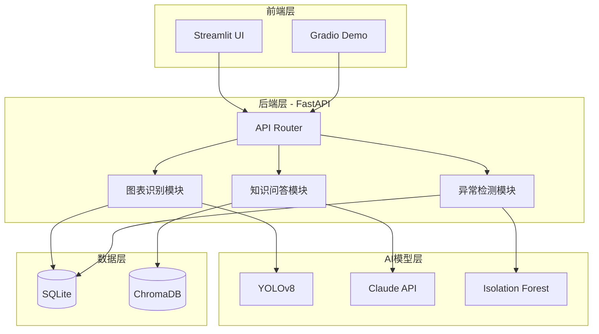
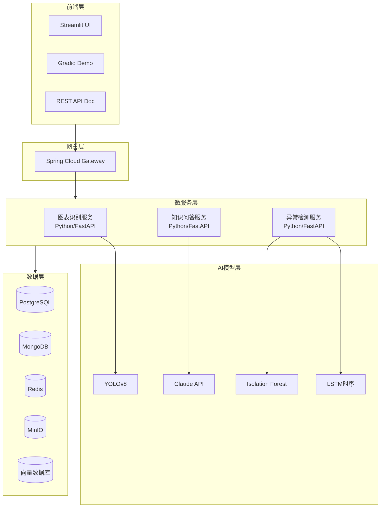
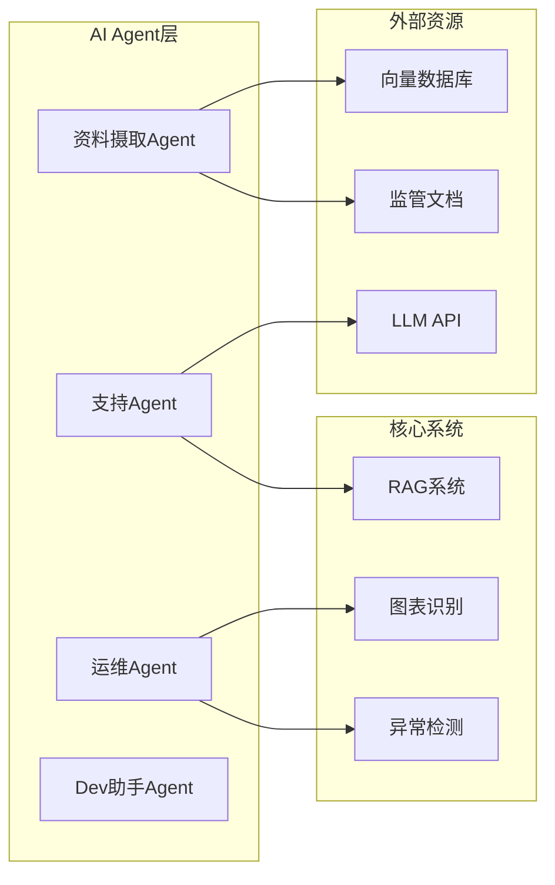

# 金融智能分析平台 (FinanceAI Analytics Platform) - 项目规划书

> **文档创建日期**: 2024-12-14 17:00
> **文档版本**: v1.1
> **最后更新**: 2024-12-14 20:55
> **下次审阅**: 2024-12-21
> **状态**: 详细技术规划文档, 主控计划见 Project_Plan.md v2.3
>
> **更新说明**: 根据团队审核意见进行了以下改进, 改进内容用 `[IMPROVED]` 标签标注
> - 架构图改用Mermaid格式（跨平台兼容）
> - MVP技术栈精简（单体架构优先）
> - 新增量化验收指标
> - 新增合规与数据治理章节
> - 新增AI Agent设计章节

---

## 项目概述

### 背景分析
基于您的技术背景：
- **4年金融科技后端经验**：暗池交易平台开发（JAVA）
- **3周AI算法经验**：计算机视觉（目标检测、追踪、识别）
- **技术优势**：后端架构设计 + 初步AI模型应用能力

### 项目定位
设计一个**实用性优先**的金融AI工具平台，重点解决真实业务场景问题，而非纯学术研究。

---

## 核心功能设计（经过优化调整）

### 功能优先级重排

#### P0 - 核心实用工具（优先级最高）
1. **实时金融图表识别与数据提取工具**
   - 利用您的CV经验
   - 解决痛点：将交易平台截图/PDF报告转换为结构化数据
   - 实用场景：暗池交易数据可视化、监管报告自动化

2. **异常交易模式检测系统**
   - 结合暗池交易经验
   - 检测异常订单、市场操纵行为
   - 技术栈：时序分析 + 异常检测算法

3. **金融文档智能问答助手**
   - 基于RAG（检索增强生成）技术
   - 针对监管文件、交易规则、金融知识库
   - 降低复杂度：使用现成LLM API（OpenAI/Claude）+ 向量数据库

#### P1 - 模型工具库（中等优先级）
4. **预置金融模型工具箱**
   - 经典模型：GARCH波动率预测、ARIMA时序预测
   - 机器学习模型：XGBoost价格预测、LSTM序列建模
   - 提供可视化调参界面

5. **数据集管理与采集指南**
   - 集成常用数据源API（Yahoo Finance、Alpha Vantage）
   - 提供采集代码模板和教程
   - 数据清洗与预处理流程

#### P2 - 增值功能（后期扩展）
6. **知识库系统**
   - 金融科技概念解释
   - 暗池交易机制说明
   - AI模型原理科普

---

## 需求分析与改进建议

### 原始需求评估

| 需求 | 可行性 | 改进建议 |
|------|--------|----------|
| 金融知识解答 | ✅ 可行 | 使用RAG + LLM API，避免从零训练模型 |
| 选择金融模型 | ✅ 可行 | 封装经典模型库，提供GUI配置界面 |
| 数据集+采集教程 | ✅ 可行 | 整合公开API，提供合规采集指南 |
| 实用工具优先 | ⭐ 强烈同意 | **调整为核心功能** |

### 关键改进点

#### 1. 技术栈合理化
**原问题**：3周AI经验，从零构建复杂模型不现实

**改进方案**：
- 使用**预训练模型**：YOLOv8（图表检测）、LayoutLM（文档解析）
- 调用**成熟API**：OpenAI GPT-4o、Claude API（知识问答）
- 采用**低代码框架**：Streamlit（快速搭建界面）

#### 2. 发挥暗池交易经验优势
**核心竞争力**：
- 理解订单簿机制、交易流程
- 熟悉监管合规要求
- 掌握高并发后端架构

**体现方式**：
- 异常检测算法针对暗池特有模式（如iceberg订单识别）
- 合规工具（MiFID II报告生成）
- 微服务架构设计（Java后端 + Python AI模型服务）

#### 3. 快速MVP策略
**阶段性交付**：
- **第1周**：图表OCR工具原型（单一功能）
- **第2-3周**：金融问答RAG系统
- **第4-6周**：异常检测Demo
- **后续迭代**：模型库、数据管理

---

## 项目架构设计

### `[IMPROVED]` MVP架构（精简版 - 团队审核后调整）

> **改进说明**：根据团队审核意见，MVP阶段采用单体架构，避免过度设计



**MVP技术栈**：
| 组件 | 选型 | 说明 |
|------|------|------|
| 后端框架 | FastAPI | 单体服务，无需Java网关 |
| 前端 | Streamlit | 快速原型 |
| 数据库 | SQLite | 开发阶段，生产切PostgreSQL |
| 向量库 | ChromaDB | 本地部署，无需Pinecone |
| 部署 | Docker Compose | 暂缓K8s |

---

### 目标架构（完整版 - 后期扩展参考）

> **说明**：以下为项目成熟后的目标架构，MVP阶段暂不实现



### 技术栈详细说明

#### 后端服务
```
语言：Java 17 (核心业务) + Python 3.10+ (AI模型)
框架：
  - Spring Boot 3.x (Java微服务)
  - FastAPI (Python AI服务)
  - Spring Cloud (服务治理)
```

#### AI/ML组件
```
深度学习：PyTorch 2.0+
计算机视觉：Ultralytics YOLOv8, OpenCV
NLP：LangChain, OpenAI API, HuggingFace Transformers
时序分析：statsmodels, Prophet, scikit-learn
```

#### 数据存储
```
关系型数据库：PostgreSQL (交易记录、用户数据)
文档数据库：MongoDB (金融知识库、模型配置)
向量数据库：ChromaDB / Pinecone (RAG检索)
缓存：Redis (实时行情、会话管理)
对象存储：MinIO (图表图片、训练数据)
```

#### 前端/可视化
```
快速原型：Streamlit (Python)
交互Demo：Gradio
可视化：Plotly, ECharts
```

---

## 项目目录结构

> **说明**：以下为目标目录结构，当前仓库处于初始化阶段

```
FinanceAI-Platform/
│
├── backend/                          # 后端服务
│   ├── gateway-service/              # API网关 (Java)
│   │   ├── src/main/java/
│   │   └── pom.xml
│   │
│   ├── chart-recognition-service/    # 图表识别服务 (Python)
│   │   ├── app/
│   │   │   ├── api/                  # FastAPI路由
│   │   │   ├── models/               # YOLO模型
│   │   │   ├── services/             # 业务逻辑
│   │   │   └── utils/                # OCR、图像处理
│   │   ├── requirements.txt
│   │   └── Dockerfile
│   │
│   ├── qa-service/                   # 知识问答服务 (Python)
│   │   ├── app/
│   │   │   ├── rag/                  # RAG检索逻辑
│   │   │   ├── knowledge_base/       # 知识库文档
│   │   │   └── embeddings/           # 向量化模块
│   │   └── requirements.txt
│   │
│   └── anomaly-detection-service/    # 异常检测服务 (Python)
│       ├── app/
│       │   ├── models/               # 异常检测模型
│       │   ├── feature_engineering/  # 特征工程
│       │   └── streaming/            # 实时处理
│       └── requirements.txt
│
├── frontend/                         # 前端应用
│   ├── streamlit_app/                # Streamlit主界面
│   │   ├── pages/
│   │   │   ├── 1_Chart_Recognition.py
│   │   │   ├── 2_QA_System.py
│   │   │   ├── 3_Anomaly_Detection.py
│   │   │   └── 4_Model_Playground.py
│   │   └── Home.py
│   │
│   └── gradio_demos/                 # 独立Demo
│       ├── chart_ocr_demo.py
│       └── qa_demo.py
│
├── ml_models/                        # 模型训练与评估
│   ├── chart_detection/
│   │   ├── train_yolo.py
│   │   ├── data/                     # 训练数据
│   │   └── weights/                  # 模型权重
│   │
│   ├── anomaly_models/
│   │   ├── isolation_forest.py
│   │   ├── lstm_autoencoder.py
│   │   └── evaluation/
│   │
│   └── financial_models/             # 经典金融模型
│       ├── garch_volatility.py
│       ├── arima_forecast.py
│       └── portfolio_optimization.py
│
├── data/                             # 数据管理
│   ├── datasets/
│   │   ├── sample_charts/            # 示例图表数据
│   │   ├── trade_data/               # 交易数据样本
│   │   └── knowledge_docs/           # 知识库文档
│   │
│   ├── collection_scripts/           # 数据采集脚本
│   │   ├── yahoo_finance_collector.py
│   │   ├── sec_filing_scraper.py
│   │   └── README.md                 # 采集教程
│   │
│   └── preprocessing/                # 数据预处理
│       ├── clean_trade_data.py
│       └── normalize_timeseries.py
│
├── docs/                             # 文档
│   ├── architecture.md               # 架构说明
│   ├── api_reference.md              # API文档
│   ├── deployment_guide.md           # 部署指南
│   ├── data_collection_guide.md      # 数据采集教程
│   └── model_explanations.md         # 模型原理说明
│
├── infrastructure/                   # 基础设施
│   ├── docker/
│   │   ├── docker-compose.yml
│   │   └── Dockerfile.*
│   │
│   ├── kubernetes/                   # K8s配置 (可选)
│   │   └── deployments/
│   │
│   └── scripts/
│       ├── init_db.sql
│       └── setup_env.sh
│
├── tests/                            # 测试
│   ├── unit/
│   ├── integration/
│   └── performance/
│
├── .env.example                      # 环境变量模板
├── README.md                         # 项目说明
├── requirements.txt                  # Python依赖（总览）
└── setup_project.sh                  # 一键初始化脚本
```

---

## 实施路线图

### `[IMPROVED]` 验收指标（团队审核后新增）

> **改进说明**：根据团队审核意见，为每个功能模块增加可量化的验收标准

| 功能模块 | 指标类型 | 目标值 | 测试方法 |
|---------|---------|--------|---------|
| **图表OCR** | 数值提取准确率 | >= 85% | 100张测试图表人工校验 |
| | 单张处理延迟 | < 3s | 性能测试 |
| | 支持图表类型 | >= 5种 | K线/柱状/饼图/折线/散点 |
| **金融问答** | Top-3召回率 | >= 70% | 50个标准问题测试集 |
| | 平均响应时间 | < 5s | 负载测试 |
| | 答案相关性评分 | >= 4/5 | 人工评估 |
| **异常检测** | 召回率 | >= 80% | 模拟异常数据测试 |
| | 误报率 | < 20% | 正常数据误判统计 |
| | 单条处理延迟 | < 100ms | 流式数据测试 |
| **API接口** | P99延迟 | < 500ms | 压力测试 |
| | 可用性 | >= 99% | 7天连续监控 |

---

### Phase 1: MVP核心功能

#### Week 1-2: 图表识别工具
**目标**：实现金融图表截图 → 数据提取

**任务清单**：
- [ ] 收集训练数据（K线图、柱状图、饼图等100-200张）
- [ ] 微调YOLOv8模型（检测图表区域）
- [ ] 集成EasyOCR（提取数值文本）
- [ ] 实现坐标系识别与数据重构算法
- [ ] 开发Streamlit界面（上传图片 → 显示提取结果）

**交付物**：
- 可运行的Demo
- 准确率评估报告
- 使用文档

#### Week 3-4: 金融知识问答系统
**目标**：搭建RAG问答助手

**任务清单**：
- [ ] 构建知识库（收集监管文件、暗池交易规则、MiFID II文档）
- [ ] 文档向量化（使用OpenAI Embeddings或开源模型）
- [ ] 设置ChromaDB向量数据库
- [ ] 集成Claude API / GPT-4实现问答
- [ ] 开发对话界面

**交付物**：
- RAG系统原型
- 知识库文档集（至少50份）
- API接口

#### Week 5-6: 异常检测Demo
**目标**：识别异常交易模式

**任务清单**：
- [ ] 准备模拟暗池交易数据（或使用公开数据集）
- [ ] 实现Isolation Forest基线模型
- [ ] 开发特征工程（订单簿不平衡、异常成交量等）
- [ ] 可视化异常得分与标记
- [ ] 简单的告警机制

**交付物**：
- 异常检测模型
- 检测报告示例
- 实时监控仪表板

---

### Phase 2: 功能完善 (6-8周)

#### Week 7-9: 模型工具库
- [ ] 实现5-8个经典金融模型（GARCH、ARIMA、Black-Scholes等）
- [ ] 设计统一参数配置界面
- [ ] 模型对比与回测功能
- [ ] 生成性能报告（PDF导出）

#### Week 10-12: 数据管理平台
- [ ] 集成Yahoo Finance、Alpha Vantage API
- [ ] 自动化数据采集调度（Airflow）
- [ ] 数据质量检查与清洗流程
- [ ] 编写详细采集教程（含合规说明）

---

### Phase 3: 优化与扩展 (持续)

#### 性能优化
- [ ] 模型推理加速（ONNX Runtime）
- [ ] 缓存策略优化
- [ ] 异步任务处理（Celery）

#### 安全与合规
- [ ] API认证与授权（OAuth 2.0）
- [ ] 数据脱敏
- [ ] 审计日志

#### 可扩展性
- [ ] 插件化模型架构
- [ ] 用户自定义策略
- [ ] 多租户支持

---

## 学习资源与数据源

### 推荐数据集

| 数据类型 | 来源 | 用途 |
|---------|------|------|
| 股票历史数据 | Yahoo Finance API | 时序预测、模型训练 |
| 财务报表 | SEC EDGAR | 文本分析、知识库 |
| 图表图像 | 自行生成 + PlotDigitizer | 图表识别训练 |
| 暗池交易数据 | 模拟生成（基于真实规则） | 异常检测 |
| 监管文档 | MiFID II官网、ESMA | 知识问答库 |

### 采集合规建议
⚠️ **重要提示**：
- 遵守数据提供商的Terms of Service
- 避免高频爬取（使用官方API）
- 敏感数据脱敏处理
- 不用于商业交易决策（仅研究/学习）

---

## 成本估算

### 开发成本（个人项目）

| 项目 | 费用 | 说明 |
|------|------|------|
| LLM API (Claude/GPT-4) | $20-50/月 | 问答系统调用 |
| 云服务器 (AWS/阿里云) | $30-100/月 | 4C8G配置 |
| 向量数据库 (Pinecone) | 免费层 | 或自建ChromaDB |
| 数据API (Alpha Vantage) | 免费层 | 限速版本 |
| GPU算力 (可选) | $0 | 本地训练或Colab免费 |
| **总计** | **$50-150/月** | 可通过开源方案降至$30/月 |

### 低成本替代方案
- LLM：使用Llama 2本地部署（需16GB+ VRAM）
- 云服务：使用本地开发，仅Demo时使用云端
- GPU：Google Colab / Kaggle免费资源

---

## 风险与挑战

### 技术风险

| 风险 | 影响 | 缓解措施 |
|------|------|----------|
| AI模型准确率不足 | 高 | 使用预训练模型 + 人工标注数据 |
| 数据获取困难 | 中 | 优先使用公开数据 + 模拟数据 |
| Java-Python服务集成 | 中 | 使用REST API + 消息队列解耦 |
| 并发性能瓶颈 | 低 | 异步处理 + 缓存策略 |

### 合规风险
- **金融数据使用**：明确标注"仅供学习研究"
- **模型输出责任**：添加免责声明，不作为投资建议
- **数据隐私**：不处理真实用户隐私数据

---

## `[IMPROVED]` 合规与数据治理（团队审核后新增）

> **改进说明**：根据团队审核意见，新增合规专项章节

### 数据采集合规

| 合规要求 | 实施措施 |
|---------|---------|
| API使用协议 | 仅使用官方API，遵守Terms of Service |
| 速率限制 | 所有爬取/API调用限制 <= 1 req/s |
| 数据来源标注 | 记录每条数据的来源、获取时间、版本 |
| 商用限制声明 | 明确标注"仅供学习研究，不用于商业决策" |

### 免责声明

系统所有LLM输出将自动附带以下声明：

```
[免责声明] 本内容由AI生成，仅供参考学习，不构成任何投资建议。
金融决策请咨询持牌专业人士。使用者需自行承担相关风险。
```

### 敏感数据处理

| 数据类型 | 处理方式 |
|---------|---------|
| 用户上传文档 | 不保存原文，仅提取结构化数据 |
| 聊天记录 | 仅保存hash和处理状态，不记录原文 |
| PII信息 | 自动检测并遮蔽（身份证号、手机号、银行卡号） |
| 日志脱敏 | 敏感字段用***替换后记录 |

### 审计与监控

- 所有API调用记录请求时间、用户ID（匿名）、响应状态
- 异常访问模式自动告警（频率异常、批量请求）
- 日志保留期限：30天，超期自动删除

---

## `[IMPROVED]` AI Agent设计（团队审核后新增）

> **改进说明**：根据团队审核意见，将AI Agent作为项目创新点纳入设计

### Agent架构概览



### Agent详细设计

#### 1. 资料摄取Agent（P0 - 与RAG同期开发）

**职责**：自动收集、清洗、分块监管PDF，输出质检报告

```python
# 伪代码示例
class DocumentIngestionAgent:
    def __init__(self, llm, vector_store):
        self.llm = llm
        self.vector_store = vector_store

    def process(self, pdf_path):
        # 1. PDF解析
        text = extract_text(pdf_path)
        # 2. 智能分块
        chunks = smart_chunking(text)
        # 3. 质量检查
        quality_report = self.validate_chunks(chunks)
        # 4. 向量化存储
        self.vector_store.add(chunks)
        return quality_report
```

**输出**：
- 文档处理报告（分块数量、质量评分、异常标记）
- 向量库更新状态

#### 2. 支持Agent（P0 - RAG核心功能）

**职责**：对话式金融问答，支持引用链路与跟问建议

**功能特性**：
- 多轮对话上下文管理
- 答案附带原文引用（文档名+页码）
- 智能跟问推荐
- 不确定回答标记

**技术选型**：LangChain + LangGraph 工具调用

#### 3. 运维Agent（P2 - 后期扩展）

**职责**：监控系统质量，提出优化建议

**监控指标**：
- RAG召回质量下降告警
- 异常检测误报率突增
- API响应延迟异常

#### 4. Dev助手Agent（P2 - 工程辅助）

**职责**：自动生成Changelog、Release Notes、README摘要

---

## 项目亮点与差异化

### 与现有解决方案对比

| 特性 | 本项目 | 通用金融平台 | 纯AI工具 |
|------|--------|--------------|----------|
| 暗池交易领域知识 | ✅ 深度融合 | ❌ | ❌ |
| 图表识别 | ✅ 定制化 | ❌ | ⚠️ 通用 |
| 实用工具优先 | ✅ | ⚠️ | ❌ |
| 开源可定制 | ✅ | ❌ | ⚠️ |
| 后端工程化 | ✅ Java微服务 | ✅ | ❌ Python脚本 |

### 核心竞争力
1. **领域专业性**：深度理解暗池交易机制
2. **工程化能力**：企业级后端架构 + AI模型服务
3. **创新点**：计算机视觉应用于金融图表解析
4. **实用性**：解决真实业务痛点（而非玩具项目）

---

## 后续扩展方向

### 短期（3-6个月）
- [ ] 移动端适配（React Native）
- [ ] 增加更多图表类型支持（技术分析指标）
- [ ] 多语言支持（中英文）
- [ ] 用户社区与案例分享

### 中期（6-12个月）
- [ ] 实时流式数据处理（Kafka + Flink）
- [ ] 强化学习交易策略回测
- [ ] 联邦学习（多方数据协作）
- [ ] SaaS化部署

### 长期愿景
- [ ] 开源社区建设
- [ ] 商业化探索（企业合规工具）
- [ ] 学术论文发表

---

## 协作建议

### 如果组建团队

**推荐角色分工**：
1. **后端工程师**（您）：架构设计、Java服务、DevOps
2. **AI工程师**：模型优化、算法研究
3. **前端工程师**：用户界面、数据可视化
4. **领域专家**：金融业务逻辑验证

### 单人开发策略
- **聚焦MVP**：先完成1-2个核心功能
- **利用开源**：最大化使用现有轮子
- **迭代优化**：快速发布 → 收集反馈 → 改进

---

## 参考资料

### 技术文档
- [YOLOv8 官方文档](https://docs.ultralytics.com/)
- [LangChain RAG教程](https://python.langchain.com/docs/use_cases/question_answering/)
- [FastAPI 最佳实践](https://fastapi.tiangolo.com/tutorial/)
- [Spring Cloud 微服务架构](https://spring.io/projects/spring-cloud)

### 金融知识
- *暗池交易机制*：《Flash Boys》- Michael Lewis
- *市场微观结构*：《Trading and Exchanges》- Larry Harris
- *量化金融*：《Python for Finance》- Yves Hilpisch

### 机器学习
- *时序预测*：Prophet by Facebook
- *异常检测*：Isolation Forest论文 (Liu et al., 2008)
- *金融AI应用*：《Machine Learning for Asset Managers》- Marcos López de Prado

---

## 总结与建议

### 项目可行性评估：5/5

**优势**：
✅ 技术栈匹配度高（Java后端 + Python AI）
✅ 领域经验独特（暗池交易）
✅ 问题定义清晰（实用工具优先）
✅ 学习曲线合理（基于已有经验）

**建议**：
1. **先做减法**：MVP阶段只做图表识别 + 知识问答
2. **重视工程化**：代码规范、单元测试、CI/CD
3. **记录过程**：撰写博客、制作教程（提升影响力）
4. **开源发布**：GitHub Star数可作为求职加分项

### 预期成果
- **3个月后**：可演示的MVP产品
- **6个月后**：完整功能的开源项目
- **1年后**：有用户使用的工具平台

### 职业发展价值
此项目可以：
- 证明**AI工程能力**（从3周到项目落地）
- 展示**全栈开发**（前后端 + AI）
- 体现**领域专业性**（金融科技）
- 作为**技术博客**素材（系列文章）

---

**项目启动建议**：先花1-2天搭建基础框架，然后立即开始第一个功能（图表识别）的开发，用实际产出验证方案可行性。

---

## `[IMPROVED]` 工程规范（团队审核后新增）

> **改进说明**：根据团队审核意见，补充工程规范和CI/CD配置

### 仓库基础文件

需补充的文件清单：
- `.gitignore` - 忽略.venv、__pycache__、.env、*.pyc等
- `LICENSE` - MIT开源协议
- `README.md` - 中英双语项目说明
- `CONTRIBUTING.md` - 贡献指南
- `SECURITY.md` - 安全策略
- `.github/ISSUE_TEMPLATE/` - Issue模板
- `.github/PULL_REQUEST_TEMPLATE.md` - PR模板

### CI/CD配置

```yaml
# .github/workflows/ci.yml
name: CI
on: [push, pull_request]
jobs:
  lint-and-test:
    runs-on: ubuntu-latest
    steps:
      - uses: actions/checkout@v4
      - uses: actions/setup-python@v5
        with:
          python-version: '3.10'
      - name: Install dependencies
        run: pip install ruff mypy pytest
      - name: Lint
        run: ruff check .
      - name: Type check
        run: mypy --ignore-missing-imports .
      - name: Test
        run: pytest tests/ -v
```

### 代码规范

| 规范项 | 工具 | 配置 |
|-------|------|------|
| 代码格式化 | ruff format | line-length=88 |
| 代码检查 | ruff check | 默认规则 |
| 类型检查 | mypy | strict模式（渐进启用） |
| 提交规范 | Conventional Commits | feat/fix/docs/refactor |

### 版本发布规范

- 语义化版本：MAJOR.MINOR.PATCH
- 每个版本发布需附带：
  - Changelog（变更说明）
  - Release Notes（发布说明）
  - 标签（git tag）

---

祝项目顺利！
